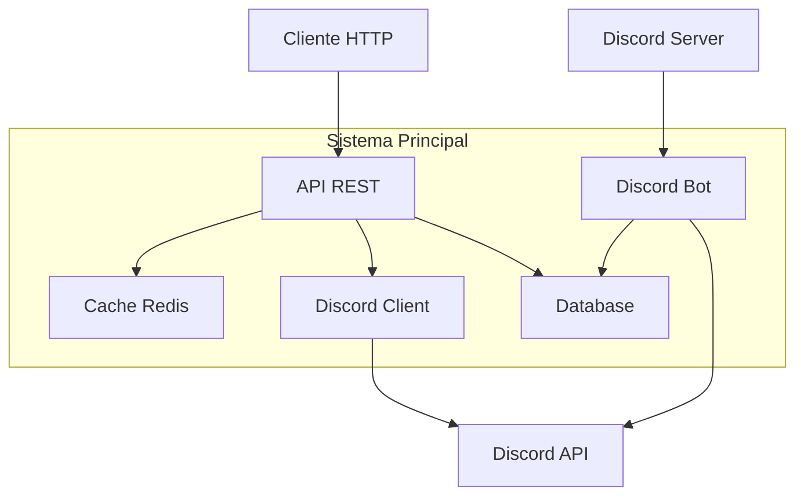
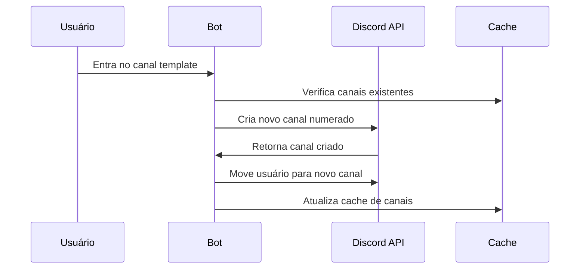

# Documento de Design

## Visão Geral

O sistema será composto por um bot Discord integrado com uma API REST que expõe informações de usuários obtidas através da API oficial do Discord. A arquitetura seguirá o padrão de microsserviços com separação clara entre o bot Discord e a API web, permitindo escalabilidade e manutenibilidade.

## Arquitetura

### Arquitetura Geral



### Componentes Principais

1. **Discord Bot**: Apenas para gerenciar canais automáticos via eventos
2. **Discord Client**: Cliente simples para consultas diretas à API do Discord
3. **REST API Service**: Expõe endpoints HTTP que fazem consultas em tempo real
4. **Cache Layer**: Redis para cache opcional de dados frequentemente acessados
5. **Database**: Armazenamento de configurações de canais automáticos

## Componentes e Interfaces

### 1. Discord Bot Service

**Responsabilidades:**

- Manter conexão WebSocket com Discord
- Processar eventos de usuário (status, atividades)
- Gerenciar canais automáticos
- Sincronizar dados com cache

**Interfaces:**

```typescript
interface DiscordBotService {
  getUserActivity(userId: string): Promise<UserActivity>;
  createAutoChannel(
    templateChannelId: string,
    userId: string
  ): Promise<Channel>;
  deleteEmptyChannels(): Promise<void>;
  updateUserCache(userId: string, data: UserData): Promise<void>;
}
```

### 2. REST API Service

**Responsabilidades:**

- Expor endpoints HTTP
- Implementar rate limiting
- Validar requisições
- Retornar dados formatados

**Endpoints:**

```
GET /api/users/{userId}/status
GET /api/users/{userId}/activity
GET /api/users/{userId}/presence
GET /api/channels/auto/{templateId}
POST /api/config/server/{serverId}
```

**Interface de Resposta:**

```typescript
interface UserStatusResponse {
  userId: string;
  status: "online" | "idle" | "dnd" | "offline";
  activities: Activity[];
  presence?: RichPresence;
  lastUpdated: string;
}

interface Activity {
  type: "playing" | "listening" | "watching" | "custom";
  name: string;
  details?: string;
  state?: string;
  timestamps?: {
    start?: number;
    end?: number;
  };
}
```

### 3. Cache Layer (Redis)

**Estrutura de Dados:**

```
user:{userId}:status -> JSON com status atual
user:{userId}:activity -> JSON com atividades
channel:{templateId}:auto -> Lista de canais criados
server:{serverId}:config -> Configurações do servidor
```

**TTL (Time To Live):**

- Status de usuário: 30 segundos
- Atividades: 60 segundos
- Configurações: 24 horas

### 4. Auto Channel Manager

**Responsabilidades:**

- Monitorar entrada/saída de usuários em canais template
- Criar canais numerados automaticamente
- Limpar canais vazios após timeout
- Gerenciar limite de canais por template

**Fluxo de Criação:**



## Modelos de Dados

### User Data Model

```typescript
interface UserData {
  id: string;
  username: string;
  discriminator: string;
  avatar?: string;
  status: UserStatus;
  activities: Activity[];
  presence?: RichPresence;
  lastSeen: Date;
}

interface RichPresence {
  applicationId?: string;
  details?: string;
  state?: string;
  largeImageKey?: string;
  largeImageText?: string;
  smallImageKey?: string;
  smallImageText?: string;
}
```

### Channel Configuration Model

```typescript
interface ChannelConfig {
  templateChannelId: string;
  serverId: string;
  namePattern: string; // ex: "jogando-{number}"
  maxChannels: number;
  emptyTimeout: number; // em minutos
  permissions: ChannelPermission[];
}
```

### Server Configuration Model

```typescript
interface ServerConfig {
  serverId: string;
  commandPrefix: string;
  autoChannels: ChannelConfig[];
  apiAccess: {
    enabled: boolean;
    allowedEndpoints: string[];
    rateLimit: number;
  };
  logging: {
    level: "error" | "warn" | "info" | "debug";
    channels: string[];
  };
}
```

## Tratamento de Erros

### Estratégias de Error Handling

1. **API Errors**:

   - Rate limiting do Discord: Implementar backoff exponencial
   - Usuário não encontrado: Retornar 404 com mensagem clara
   - Servidor indisponível: Retornar 503 com retry-after header

2. **Bot Errors**:

   - Perda de conexão: Reconexão automática com backoff
   - Permissões insuficientes: Log detalhado e notificação
   - Canal não encontrado: Limpeza automática do cache

3. **Cache Errors**:
   - Redis indisponível: Fallback para consulta direta ao Discord
   - Dados corrompidos: Invalidação e recache automático

### Error Response Format

```typescript
interface ErrorResponse {
  error: {
    code: string;
    message: string;
    details?: any;
    timestamp: string;
    requestId: string;
  };
}
```

## Estratégia de Testes

### Testes Unitários

- Validação de modelos de dados
- Lógica de criação de canais automáticos
- Formatação de respostas da API
- Funções de cache e invalidação

### Testes de Integração

- Comunicação com Discord API
- Fluxo completo de criação de canais
- Sincronização entre bot e API REST
- Persistência de configurações

### Testes End-to-End

- Cenários completos de uso da API
- Comportamento do bot em servidor real (ambiente de teste)
- Performance sob carga
- Recuperação após falhas

### Ambiente de Testes

```typescript
interface TestEnvironment {
  discordTestServer: string;
  testBotToken: string;
  redisTestInstance: string;
  mockUsers: TestUser[];
  testChannels: TestChannel[];
}
```

## Considerações de Performance

### Otimizações

1. **Cache Inteligente**: Cache agressivo de dados de usuário com invalidação baseada em eventos
2. **Rate Limiting**: Implementar rate limiting tanto para API externa quanto para Discord API
3. **Batch Operations**: Agrupar operações de limpeza de canais
4. **Connection Pooling**: Pool de conexões para database e Redis

### Métricas de Monitoramento

- Latência de resposta da API (< 2s)
- Taxa de hit do cache (> 80%)
- Uptime do bot (> 99%)
- Número de canais automáticos ativos
- Requests por minuto na API

### Limites e Quotas

- Discord API: 50 requests/second por bot
- API REST: 100 requests/minute por IP
- Canais automáticos: 10 por template
- Cache TTL: Configurável por tipo de dado
