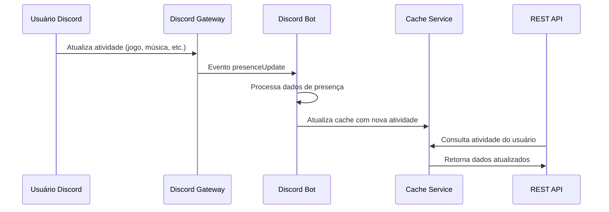

# Documento de Design - Correção de Captura de Atividades

## Visão Geral

A solução implementará a captura adequada de atividades dos usuários através da configuração correta dos intents do Discord e implementação de eventos WebSocket. O problema atual é que o bot não possui o intent `GuildPresences` necessário para acessar dados de presença, e não está processando eventos de atualização de presença em tempo real.

## Arquitetura

### Fluxo de Captura de Atividades



### Componentes Afetados

1. **DiscordBotService**: Adicionar intent GuildPresences e event listeners
2. **Event Handlers**: Novo sistema para processar eventos de presença
3. **Cache Service**: Melhorar armazenamento de dados de atividade
4. **API Endpoints**: Garantir que retornem dados atualizados

## Componentes e Interfaces

### 1. Configuração de Intents

**Problema Atual:**
```typescript
// src/bot/services/DiscordBotService.ts - ATUAL
this.client = new Client({
  intents: [
    GatewayIntentBits.Guilds,
    GatewayIntentBits.GuildVoiceStates,
    GatewayIntentBits.GuildMessages,
    GatewayIntentBits.MessageContent
  ]
});
```

**Solução:**
```typescript
// Configuração corrigida com intent necessário
this.client = new Client({
  intents: [
    GatewayIntentBits.Guilds,
    GatewayIntentBits.GuildVoiceStates,
    GatewayIntentBits.GuildMessages,
    GatewayIntentBits.MessageContent,
    GatewayIntentBits.GuildPresences  // NOVO: Necessário para atividades
  ]
});
```

### 2. Event Handler para Presença

**Nova Interface:**
```typescript
interface PresenceEventHandler {
  handlePresenceUpdate(oldPresence: Presence | null, newPresence: Presence): Promise<void>;
  processActivityData(presence: Presence): UserActivityData;
  updateUserCache(userId: string, activityData: UserActivityData): Promise<void>;
}

interface UserActivityData {
  userId: string;
  status: UserStatus;
  activities: Activity[];
  lastUpdated: Date;
  clientStatus?: {
    desktop?: string;
    mobile?: string;
    web?: string;
  };
}
```

### 3. Melhorias no Cache Service

**Extensão da Interface Existente:**
```typescript
interface CacheService {
  // Métodos existentes...
  
  // Novos métodos para atividades
  setUserPresence(userId: string, presence: UserActivityData, ttl?: number): Promise<void>;
  getUserPresence(userId: string): Promise<UserActivityData | null>;
  invalidateUserPresence(userId: string): Promise<void>;
  
  // Batch operations para performance
  setMultipleUserPresences(presences: Map<string, UserActivityData>): Promise<void>;
  getUserPresencesBatch(userIds: string[]): Promise<Map<string, UserActivityData>>;
}
```

### 4. Atualização do DiscordClient

**Modificação para usar dados cached:**
```typescript
class DiscordClient {
  // Método atualizado para priorizar cache
  async getUserActivities(userId: string, guildId?: string): Promise<Activity[]> {
    // 1. Tentar obter do cache primeiro
    const cachedPresence = await this.cacheService.getUserPresence(userId);
    if (cachedPresence && this.isCacheValid(cachedPresence)) {
      return cachedPresence.activities;
    }
    
    // 2. Fallback para API REST (limitado)
    const userData = await this.getUserData(userId, guildId);
    return userData.activities;
  }
  
  private isCacheValid(presence: UserActivityData): boolean {
    const maxAge = 5 * 60 * 1000; // 5 minutos
    return Date.now() - presence.lastUpdated.getTime() < maxAge;
  }
}
```

## Modelos de Dados

### Estrutura de Dados de Presença

```typescript
interface DiscordPresenceData {
  user: {
    id: string;
  };
  guild_id?: string;
  status: 'online' | 'idle' | 'dnd' | 'offline';
  activities: DiscordActivity[];
  client_status: {
    desktop?: 'online' | 'idle' | 'dnd';
    mobile?: 'online' | 'idle' | 'dnd';
    web?: 'online' | 'idle' | 'dnd';
  };
}

interface ProcessedActivity {
  type: 'playing' | 'listening' | 'watching' | 'custom' | 'competing';
  name: string;
  details?: string;
  state?: string;
  timestamps?: {
    start?: number;
    end?: number;
  };
  assets?: {
    large_image?: string;
    large_text?: string;
    small_image?: string;
    small_text?: string;
  };
  party?: {
    id?: string;
    size?: [number, number];
  };
}
```

### Cache Key Structure

```typescript
// Estrutura de chaves no cache
const CACHE_KEYS = {
  USER_PRESENCE: (userId: string) => `presence:${userId}`,
  USER_ACTIVITIES: (userId: string) => `activities:${userId}`,
  GUILD_PRESENCES: (guildId: string) => `guild_presences:${guildId}`,
  PRESENCE_BATCH: (guildId: string) => `presence_batch:${guildId}`
};

// TTL configurations
const CACHE_TTL = {
  USER_PRESENCE: 300, // 5 minutos
  USER_ACTIVITIES: 180, // 3 minutos
  OFFLINE_USER: 900, // 15 minutos para usuários offline
  BATCH_DATA: 60 // 1 minuto para dados em lote
};
```

## Tratamento de Erros

### Estratégias Específicas

1. **Intent não habilitado:**
```typescript
// Detecção durante inicialização
private async validateIntents(): Promise<void> {
  try {
    // Tentar acessar dados de presença de teste
    const testGuild = this.client.guilds.cache.first();
    if (testGuild) {
      const presences = testGuild.presences.cache;
      if (presences.size === 0) {
        logger.warn('GuildPresences intent may not be enabled', {
          component: 'DiscordBotService',
          operation: 'intent_validation'
        });
      }
    }
  } catch (error) {
    logger.error('Failed to validate intents', {
      component: 'DiscordBotService',
      operation: 'intent_validation'
    }, error);
  }
}
```

2. **Eventos de presença perdidos:**
```typescript
// Recuperação periódica
private setupPresenceRecovery(): void {
  setInterval(async () => {
    try {
      await this.syncGuildPresences();
    } catch (error) {
      logger.error('Presence recovery failed', {
        component: 'PresenceEventHandler',
        operation: 'recovery_sync'
      }, error);
    }
  }, 5 * 60 * 1000); // A cada 5 minutos
}
```

3. **Cache indisponível:**
```typescript
// Fallback para dados em memória
private readonly memoryCache = new Map<string, UserActivityData>();

async getUserPresence(userId: string): Promise<UserActivityData | null> {
  try {
    return await this.cacheService.getUserPresence(userId);
  } catch (error) {
    logger.warn('Cache unavailable, using memory fallback', {
      component: 'PresenceEventHandler',
      operation: 'cache_fallback'
    });
    return this.memoryCache.get(userId) || null;
  }
}
```

## Estratégia de Testes

### Testes de Integração

1. **Teste de Intent Configuration:**
```typescript
describe('Discord Bot Intents', () => {
  it('should include GuildPresences intent', () => {
    const service = new DiscordBotService(mockDb, mockCache);
    const client = service.getClient();
    expect(client.options.intents).toContain(GatewayIntentBits.GuildPresences);
  });
});
```

2. **Teste de Event Processing:**
```typescript
describe('Presence Event Handler', () => {
  it('should process presence update events', async () => {
    const handler = new PresenceEventHandler(mockCache);
    const mockPresence = createMockPresence();
    
    await handler.handlePresenceUpdate(null, mockPresence);
    
    expect(mockCache.setUserPresence).toHaveBeenCalledWith(
      mockPresence.userId,
      expect.objectContaining({
        activities: expect.any(Array),
        status: mockPresence.status
      })
    );
  });
});
```

3. **Teste de Cache Integration:**
```typescript
describe('Activity Cache Integration', () => {
  it('should return cached activities when available', async () => {
    const cachedData = createMockActivityData();
    mockCache.getUserPresence.mockResolvedValue(cachedData);
    
    const activities = await discordClient.getUserActivities('123456789');
    
    expect(activities).toEqual(cachedData.activities);
    expect(mockCache.getUserPresence).toHaveBeenCalledWith('123456789');
  });
});
```

### Testes End-to-End

1. **Fluxo completo de captura:**
   - Simular evento de presença do Discord
   - Verificar processamento e cache
   - Testar resposta da API

2. **Cenários de falha:**
   - Intent desabilitado
   - Cache indisponível
   - Eventos perdidos

## Considerações de Performance

### Otimizações Implementadas

1. **Debouncing de eventos:**
```typescript
private readonly presenceUpdateQueue = new Map<string, NodeJS.Timeout>();

private debouncePresenceUpdate(userId: string, presence: Presence): void {
  // Cancelar update anterior se existir
  const existingTimeout = this.presenceUpdateQueue.get(userId);
  if (existingTimeout) {
    clearTimeout(existingTimeout);
  }
  
  // Agendar novo update com delay
  const timeout = setTimeout(async () => {
    await this.processPresenceUpdate(userId, presence);
    this.presenceUpdateQueue.delete(userId);
  }, 1000); // 1 segundo de debounce
  
  this.presenceUpdateQueue.set(userId, timeout);
}
```

2. **Batch processing:**
```typescript
private readonly batchProcessor = {
  queue: new Map<string, UserActivityData>(),
  timer: null as NodeJS.Timeout | null,
  
  add(userId: string, data: UserActivityData): void {
    this.queue.set(userId, data);
    
    if (!this.timer) {
      this.timer = setTimeout(() => this.flush(), 2000);
    }
  },
  
  async flush(): Promise<void> {
    if (this.queue.size > 0) {
      await this.cacheService.setMultipleUserPresences(this.queue);
      this.queue.clear();
    }
    this.timer = null;
  }
};
```

3. **Memory management:**
```typescript
// Limpeza automática de cache em memória
private setupMemoryCleanup(): void {
  setInterval(() => {
    const now = Date.now();
    const maxAge = 10 * 60 * 1000; // 10 minutos
    
    for (const [userId, data] of this.memoryCache.entries()) {
      if (now - data.lastUpdated.getTime() > maxAge) {
        this.memoryCache.delete(userId);
      }
    }
  }, 5 * 60 * 1000); // Limpeza a cada 5 minutos
}
```

### Métricas de Monitoramento

- Eventos de presença processados por minuto
- Taxa de hit do cache para atividades
- Latência de processamento de eventos
- Número de usuários com atividades ativas
- Erros de intent/permissão por hora